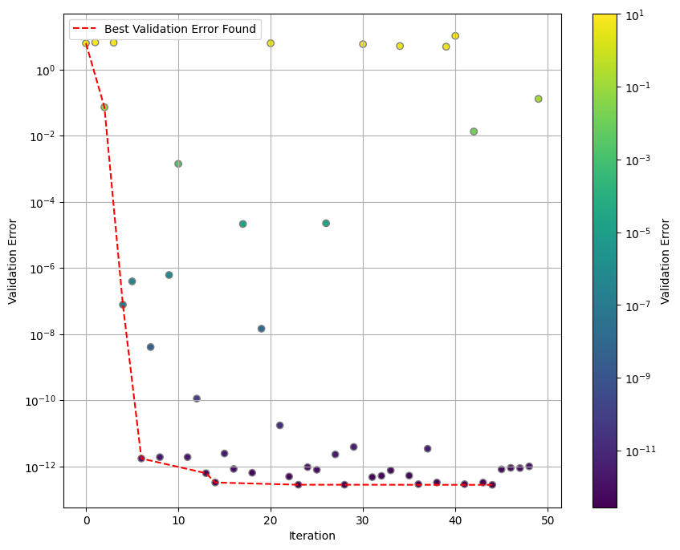

# Hp Greedy Bayesian Optimization

The Reducid Basis framework is an approach for building gravitational waves surrogates. The hp-greedy refinement [[1]](#1)[[2]](#2) is an extention of this approach. This refinement can lead to faster models without any loss of precision, but it adds the complexity of hyperparameter selection.

Here we apply bayesian optimization methods [[3]](#3)[[4]](#4) to automate the hyperparameter selection process, aiming to construct an optimal reduced basis.


## Let's begin with a simple optimization task

In order to construct a reduced basis we need:

* **Training Set**: each object of this set is a time series representing a gravitational wave.
* **Physical Points**: an array with the time points corresponding to the time series.
* **Wave Parameters of the Training Set**: an array with the parameters corresponding to each gravitational wave in the training set. *Note that there must be an equal number of parameters and gravitational waves.*

For the optimization task we add a **validation set** and the **wave parameters of the validation set**.

The key libraries used are [scikit-reducedmodel](https://github.com/francocerino/scikit-reducedmodel) and [optuna](https://optuna.org/).

We start by loading the files provided in the [data](data/) folder (in order to generate your own data, go [here](generate-gravitational-waves)):

``` python
import numpy as np

# physical points
times = np.linspace(-2750, 100, 28501)

# training set
filepath_train = "../../data/1d/1d_400_q_1_to_8.npy"
train = np.load(filepath_train)  
parameters_train = np.linspace(1, 8, train.shape[0])

# validation set
filepath_valid = "../../data/1d/1d_300_q_1_to_8.npy"
valid = np.load(filepath_valid)
parameters_valid = np.linspace(1, 8, valid.shape[0])
```

Now we need to specify the hyperparameters for the optimization inside a dictionary. Here we give the minimun and maximum values for the optimization, for each hyperparameter.

Also we need to create a callable object named `objective` for the optimization.


``` python
from objective import Objective

hyperparameters = {"nmax" : [5, 15],
                   "lmax" : [0, 5],
                   "q_index" : [0, train.shape[0]-1]}

objective = Objective(times=times,
                      train=train,
                      valid=valid,
                      parameters_train=parameters_train,
                      parameters_valid=parameters_valid,
                      hyperparameters=hyperparameters)
```

Finally we can start the optimization creating an study. See the [optuna](https://optuna.org/) page for more details.

``` python
from optuna.study import create_study
from optuna.samplers import TPESampler


study_name= f"simple-optimization-ts{train.shape[0]}-vs{valid.shape[0]}"

study = create_study(study_name=study_name,
                            storage="sqlite:///studies.db", 
                            load_if_exists=False,   # change to True to continue an existing study
                            sampler=TPESampler(n_startup_trials=5, 
                                               multivariate=True, 
                                               seed=12))

study.optimize(objective, n_trials=50, gc_after_trial=True)
```

You can see the evolution of the best validation error found in the following figure:



Go to the [notebooks/optimize-reduced-basis](notebooks/optimize-reduced-basis) folder and open the [01-simple-optimization.ipynb](notebooks/optimize-reduced-basis/01-simple-optimization.ipynb) notebook to run this optimization.

# References

<a id=1>[1]</a>
Eftang, Jens L., Anthony T. Patera, and Einar M. Ronquist. “An ‘Hp’ Certified Reduced Basis Method for Parametrized Elliptic Partial Differential Equations.” SIAM, October 2010. https://dspace.mit.edu/handle/1721.1/58468.

<a id=2>[2]</a>
Cerino, Franco, J. Andrés Diaz-Pace, and Manuel Tiglio. “An Automated Parameter Domain Decomposition Approach for Gravitational Wave Surrogates Using Hp-Greedy Refinement.” arXiv, December 16, 2022. https://doi.org/10.48550/arXiv.2212.08554.

<a id=3>[3]</a>
Shahriari, B., Swersky, K., Wang, Z., Adams, R. P., de Freitas, N. Taking the human out of the loop: A review of bayesian optimization. Proceedings of the IEEE, 104 (1), 148–175, 2016. https://ieeexplore.ieee.org/document/7352306

<a id=4>[4]</a>
Brochu, E., Cora, V. M., de Freitas, N. A tutorial on bayesian optimization of expensive cost functions, with application to active user modeling and hierarchical reinforcement learning, 2010. https://arxiv.org/abs/2212.08554