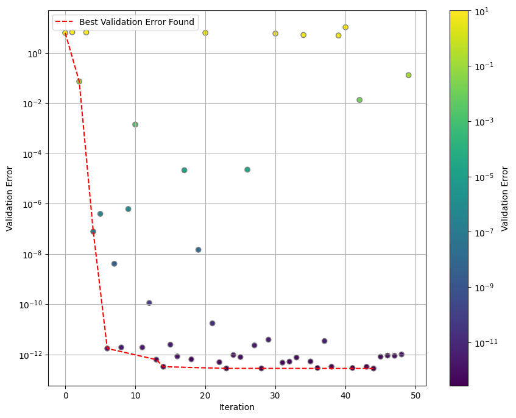
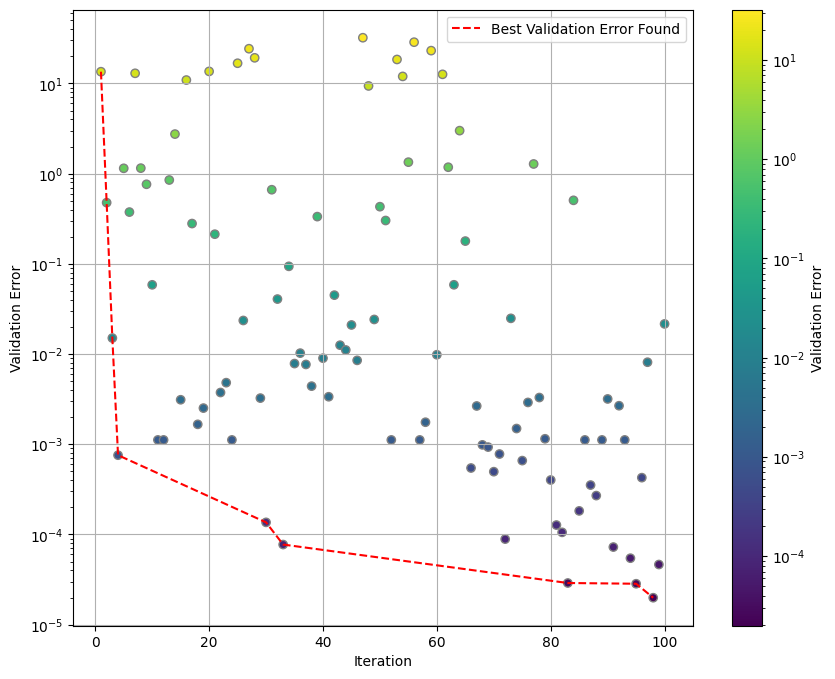

# Hp Greedy Bayesian Optimization

The Reducid Basis framework is an approach for building gravitational waves surrogates. The hp-greedy refinement [[1]](#1)[[2]](#2) is an extention of this approach. This refinement can lead to faster models without any loss of precision, but it adds the complexity of hyperparameter selection.

Here we apply bayesian optimization methods [[3]](#3)[[4]](#4) to automate the hyperparameter selection process, aiming to construct an optimal reduced basis. More concretely, we used the Three-Structured Parzen Estimator (TPE) algorithm [[5](#5)] implemented in [Optuna](https://optuna.org/) .

# Gravitational Waves

In our datasets, each gravitational wave is represented as a complex time series, with the real part representing the plus polarization and the imaginary part representing the cross polarization."

These waves are parametrized, and we worked with 3 different cases:

* **1D Case**: No spin, the only free parameter is $q = m1/m2$
* **2D Case**: Two aligned spins with the same magnitude are added to the 1D case, meaning that $χ_{1z} = χ_{2z}$
* **3D Case**: The two spins are allowed to vary, but independently: in general, $χ_{1z} \not = χ_{2z}$.

Go to [this folder](generate-gravitational-waves) to see how we generated the datasets we used as our ground truth.

# Prerequisites

The key libraries used are [scikit-reducedmodel](https://github.com/francocerino/scikit-reducedmodel) and [optuna](https://optuna.org/) version 3.1.1. You can install them via pip:

```
pip install Scikit-ReducedModel
pip install optuna==3.1.1
```

# Quick Optimization Tutorial

In order to construct a reduced basis we need:

* **Training Set**: each object of this set is a time series representing a gravitational wave.
* **Physical Points**: an array with the time points corresponding to the time series.
* **Wave Parameters of the Training Set**: an array with the parameters corresponding to each gravitational wave in the training set. *Note that there must be an equal number of parameters and gravitational waves.*

For the optimization task we add a **validation set** and the **wave parameters of the validation set**.


We start by loading the files provided in the [data](data/) folder (in order to generate your own data, go [here](generate-gravitational-waves)):

``` python
import numpy as np

# physical points
times = np.linspace(-2750, 100, 28501)

# training set
filepath_train = "../../data/1d/1d_400_q_1_to_8.npy"
train = np.load(filepath_train)  
parameters_train = np.linspace(1, 8, train.shape[0])

# validation set
filepath_valid = "../../data/1d/1d_300_q_1_to_8.npy"
valid = np.load(filepath_valid)
parameters_valid = np.linspace(1, 8, valid.shape[0])
```

Now we need to specify the hyperparameters for the optimization inside a dictionary. Here we give the minimun and maximum values for the optimization, for each hyperparameter.

Also we need to create a callable object named `objective` for the optimization.


``` python
from objective import Objective

hyperparameters = {"nmax" : [5, 15],
                   "lmax" : [0, 5],
                   "q_index" : [0, train.shape[0]-1]}

objective = Objective(times=times,
                      train=train,
                      valid=valid,
                      parameters_train=parameters_train,
                      parameters_valid=parameters_valid,
                      hyperparameters=hyperparameters)
```

If we would like to fix `nmax` or `lmax` to a specific value, e.g if we want `nmax = 10`, we would just pass that value:

``` python
hyperparameters = {"nmax" : 10,
                   "lmax" : [0, 5],
                   "q_index" : [0, train.shape[0]-1]}
```          

We can also pass through this dictionary other valid parameters for building the reduced basis as `normalize` or `greedy_tol`, see [valid parameters here.](https://scikit-reducedmodel.readthedocs.io/en/latest/skreducedmodel.html#skreducedmodel.reducedbasis.ReducedBasis)


Finally we can start the optimization creating an study. See the [optuna](https://optuna.org/) page for more details.

``` python
from optuna.study import create_study
from optuna.samplers import TPESampler


study_name= f"simple-optimization-ts{train.shape[0]}-vs{valid.shape[0]}"

study = create_study(study_name=study_name,
                            storage="sqlite:///studies.db", 
                            load_if_exists=False,   # change to True to continue an existing study
                            sampler=TPESampler(n_startup_trials=5, 
                                               multivariate=True, 
                                               seed=12))

study.optimize(objective, n_trials=50, gc_after_trial=True)
```

You can see the evolution of the best validation error found in the following figure:




After the optimization, you can see the best hyperparameters found:
``` python
best_params = study.best_params; 
for param, value in best_params.items():
    print(f"Best {param} = {value}") 
print(f"Best Validation Error {study.best_value:.3e}")
```
output:
``` 
Best lmax = 4
Best nmax = 15
Best q_index = 295
Best Validation Error 2.754e-13
```

Go to the [notebooks/optimize-reduced-basis](notebooks/optimize-reduced-basis) folder and open the [01-simple-optimization.ipynb](notebooks/optimize-reduced-basis/01-simple-optimization.ipynb) notebook to run this optimization.

# 2D and 3D Cases

In 2D and 3D cases you'll first have to generate your own data ([see how](generate-gravitational-waves)).


For example, for a 2D case you can generate a training set with 3000 waves using our script with the folling command:


``` bash
python generate-gravitational-waves.py -d 2 -1 100 -x 30
```

then a validation set:
``` bash
python generate-gravitational-waves.py -d 2 -1 50 -x 15
```

and a smaller test set:
``` bash
python generate-gravitational-waves.py -d 2 -1 30 -x 12
```


then you load your data:

``` python
import numpy as np

# physical points
times = np.linspace(-2750, 100, 28501)

# training set
filepath_train = "<your-folder-name-here>/2d-complex-q100xchi30-total3000.npy"   
train = np.load(filepath_train)  
qs_train = np.linspace(1, 8, 100)
chis_train = np.linspace(-0.8, 0.8, 30)
parameters_train = np.array([(q, chi) for q in qs_train for chi in chis_train])

# validation set
filepath_valid = "<your-folder-name-here>/2d-complex-q50xchi15-total750.npy"
valid = np.load(filepath_valid) 
qs_valid = np.linspace(1, 8, 50)
chis_valid = np.linspace(-0.8, 0.8, 15)
parameters_valid = np.array([(q, chi) for q in qs_valid for chi in chis_valid])

# test set
filepath_test = "<your-folder-name-here>/2d-complex-q30xchi12-total360.npy"
test = np.load(filepath_test)
qs_test = np.linspace(1, 8, 30)
chis_test = np.linspace(-0.8, 0.8, 12)
parameters_test = np.array([(q, chi) for q in qs_test for chi in chis_test])
```

**Note** that here the parameters have two dimensions, and that $q$ goes before $\chi_z$. This order is important.

In the hyperparameters dictionary, you must put the `q_index` before the `chi_index`.

``` python
import optuna
from optuna.samplers import TPESampler
from objective import Objective

hyperparameters = {"nmax" : [10, 25],
                   "lmax" : [0, 10],
                   "q_index" : [0, qs_train.shape[0] - 1],
                   "chi_index" : [0, chis_train.shape[0] - 1]}

objective = Objective(times=times, 
                      train=train, 
                      valid=valid, 
                      parameters_train=parameters_train, 
                      parameters_valid=parameters_valid, 
                      hyperparameters= hyperparameters)

study_name = f"2DTPE-ts{train.shape[0]}-vs{valid.shape[0]}"

study = optuna.create_study(study_name=study_name,
                                storage="sqlite:///2d-studies.db", 
                                load_if_exists=True, 
                                sampler=TPESampler(multivariate=True))

study.optimize(objective, n_trials=50, gc_after_trial=True)
```

This optimization can take several hours to complete if the number of trials is too large, so it is advisable to stick to 50 or less trials.

Here you can see the evolution of the best error found for 100 trials



And the best hyperamenters found

```python
best_params = study.best_params; 
for param, value in best_params.items():
    print(f"Best {param} = {value}") 
print(f"Best Validation Error {study.best_value:.3e}")
```
output:
```
Best q_index = 99
Best chi_index = 18
Best lmax = 4
Best nmax = 25
Best Validation Error 1.990e-05
```

You can open [this notebook](notebooks\optimize-reduced-basis\03-2d-optimization.ipynb) to run this example.

### Order of Seed Indices

As mentioned before, the order of `q_index` and `chi_index` should be respected. 
In the 2D case `q_index` goes before `chi_index`. 

In the 3D case you would have `q_index`, `chi1_index` and `chi2_index`, in that order:
``` python
hyperparameters = {"nmax" : [10, 25],
                   "lmax" : [0, 10],
                   "q_index" : [0, qs_train.shape[0] - 1],
                   "chi1_index" : [0, chis_train.shape[0] - 1],
                   "chi2_index" : [0, chis_train.shape[0] - 1]}
```

# TPE Toy Model


If you want to understand better the TPE algorithm [this notebook](notebooks\understand-tpe\00-Understanding-TPE.ipynb) may help.

# References

<a id=1>[1]</a>
Eftang, Jens L., Anthony T. Patera, and Einar M. Ronquist. “An ‘Hp’ Certified Reduced Basis Method for Parametrized Elliptic Partial Differential Equations.” SIAM, October 2010. https://dspace.mit.edu/handle/1721.1/58468.

<a id=2>[2]</a>
Cerino, Franco, J. Andrés Diaz-Pace, and Manuel Tiglio. “An Automated Parameter Domain Decomposition Approach for Gravitational Wave Surrogates Using Hp-Greedy Refinement.” arXiv, December 16, 2022. https://doi.org/10.48550/arXiv.2212.08554.

<a id=3>[3]</a>
Shahriari, B., Swersky, K., Wang, Z., Adams, R. P., de Freitas, N. Taking the human out of the loop: A review of bayesian optimization. Proceedings of the IEEE, 104 (1), 148–175, 2016. https://ieeexplore.ieee.org/document/7352306

<a id=4>[4]</a>
Brochu, E., Cora, V. M., de Freitas, N. A tutorial on bayesian optimization of expensive cost functions, with application to active user modeling and hierarchical reinforcement learning, 2010. https://arxiv.org/abs/2212.08554

<a id=5>[5]</a> Bergstra, James, Rémi Bardenet, Yoshua Bengio, and Balázs Kégl. “Algorithms for Hyper-Parameter Optimization.” In Advances in Neural Information Processing Systems, Vol. 24. Curran Associates, Inc., 2011. https://papers.nips.cc/paper_files/paper/2011/hash/86e8f7ab32cfd12577bc2619bc635690-Abstract.html.